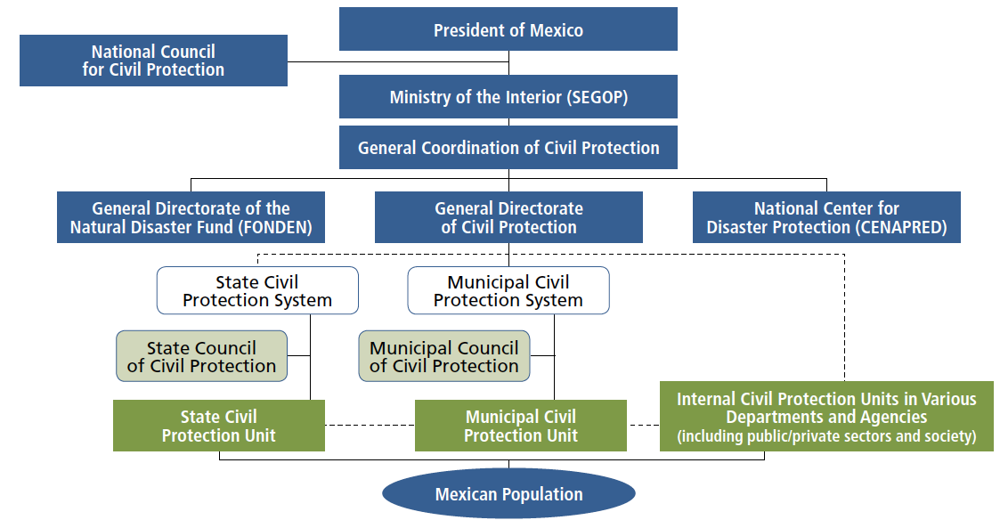
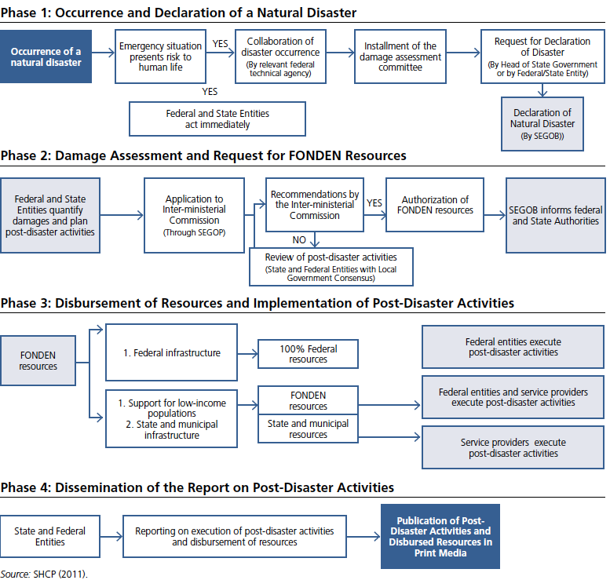
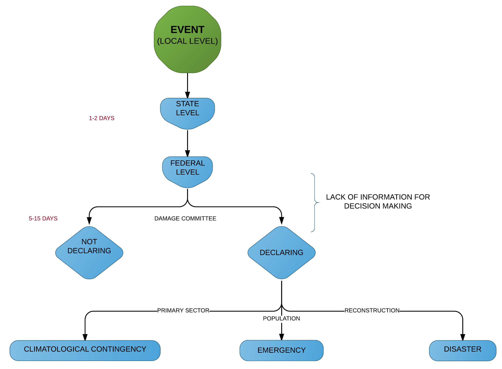
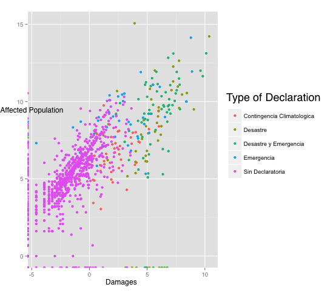

---  
output:
  pdf_document:
    fig_caption: yes
    includes:
      in_header: template_1.sty
    keep_tex: yes
    latex_engine: xelatex
    number_sections: yes
    toc: no
    toc_depth: 3
---

#Introduction 

Over the last decade, Mexico has experienced an increase in the economic costs associated with hydro meteorological disasters such as floods, hurricanes and droughts. This is attributed to the combination of an increasing population and expanding economic activities along Mexico’s coastal areas and arid zones with the mismanagement of its urban growth. The most expensive year regarding disaster relief in Mexican history occurred in 2010 driven by geological and hydro meteorological phenomenon’s, with an economic loss equivalent to 0.8% of the country’s GDP.\footnote{CENAPRED(2010)} 
Due to the effects of climate change and the unplanned expansion of urban areas, damages and losses from hydro meteorological events will likely continue to grow. In preparation, Mexico must strengthen its existing mechanisms for generating economic development, including Disaster Risk Management and resilience to climate change as key components of its development process.\footnote{Garcia A, Muñoz C (2014) The Effect of Natural Disasters on Mexico’s Regional Economic Growth: Growing Disparity or Creative Destruction? Centro Mario Molina }

Disaster resilience refers to the *ability of a system and its component parts to anticipate, absorb, accommodate, or recover from the effects of a hazardous event in a timely and efficient manner, including through ensuring the preservation, restoration, or improvement of its essential basic structures and functions*. \footnote{IPCC, 2012: Glossary of terms. In: Managing the Risks of Extreme Events and Disasters to Advance Climate Change } Three of the main factors for achieving resilience are: preparedness, reaction time and adaptability. For each of these factors, tools that enable monitoring and event identification are extremely important\footnote{Ramirez-Marquez JE, Rocco CM. (2009) Stochastic network interdiction optimization via capacitated network reliability modeling and probabilistic solution discovery. Reliability Engineering and System Safety; 94(5):913–921}specially for public policy management. 

Regarding Mexican Disaster Risk Management the Ministry of Interior (SEGOB) is responsible for manage the National Disaster Fund (FONDEN), the National Center for Preventing Disasters (CENAPRED) and the National System for Civil Protection (SINAPROC).\footnote{this section relies heavily in the 2nd chapter "National context" Garcia, A (2014) Desastres Naturales: ¿Destrucción Creativa?}
SINAPROC is in charge of the first response during a disaster, mainly attending affected population.  FONDEN is a  national fund for attending public spending regarding disaster recovery. Meanwhile CENAPRED does the post disaster damage evaluation and the research for preparedness and early warning alarm system. The figure 1 explains the organization chart and the hierarchy of Mexican Disaster Risk Management.

The Mexican Civil Protection Law defines a disaster as *“… a situation in which the population of one or more State entities suffers several damages from the impact of a natural or man–made disaster calamity, resulting in loss of life, infrastructure or environment, in a way that disrupts the social structure and disturbs the essential activities of society, affecting livelihoods.”* When a disaster occurs, the local government (municipal and state level) attends the disaster through the local civil protection system and a state fund for disasters. If the disaster overwhelms local capacity, the state government request help from SEGOB. One of the main problems is there are no indicators nor measures for "local capacity".

\break

When a disaster occurs the process of declaration is the following: First, SEGOB must issue a declaration of a natural disaster in order for FONDEN resources to be accessible by affected federal agencies or state governments. Once this declaration has been made, the federal agencies and/or state government(s) can apply for funding and the damage assessment process. In order to ensure efficiency and accuracy of the damage assessment process, a committee composed by CENAPRED, the National Water Commission (CONAGUA) and the  National Forestry Commission (CONAFOR), make a report of the disaster. Based on the findings of the damage assessment, SEGOB reviews the related funding applications, determines the appropriate allocations, and requests the Ministry of Finance and Public Credit (SHCP) to convene the FONDEN Technical Committee to authorize the transfer of funds to a subaccount for the reconstruction program in the FONDEN Trust. From this subaccount, resources are transferred to the service providers implementing reconstruction works. FONDEN resources finance 100 percent of the reconstruction costs for federal assets and 50 percent of those for local assets the first time that the assets are affected by a disaster, afterwards the percentage of recovery declines and local government should buy insurance for the reconstructed assets\footnote{GFDRR (2012)}. Figure 2 explains the process to access and execute FONDEN resources for post-disaster reconstruction.

\break
  
It is important to mention that federal disaster relief assistance is a grant and all the system depends in the declaration made by SEGOB. If the disaster is not declared then the state has no help from the federal level, meaning, it only has local assistance. If the disaster is declared, SEGOB has four types of declaration\footnote{The type of aid depends on the type of declaration}

\break

#Research Problem 
 
The lack of information during and after a disaster is one of the main problems for public policy makers for disaster mitigation and even conflict prevention.\footnote{Meier, Patrick. (2014). Crisis Mapping in Areas of Limited Statehood. In Information and Communication Technologies in Areas of Limited Statehood, ed. Steven Livingston and Gregor Walter-Drop. Oxford University Press}\footnote{Meier, Patrick. (2014). Human Computation for Disaster Response. In Handbook of Human Computation, ed. Pietro Michelucci et. al, Springer}  As explained above when Mexican government  decide between declaring and dot declaring a disaster they only rely on the information given by the local governments  and  the  meteorological data (precipitation, wind and temperature).
Data regarding the expost-damage assesment shows an 

#Research Objectives
This project analyzes the main variables determining the Mexican process of disaster declaration looking forward a predictor for helping Mexican government to make a transparent process regarding disasters driven by hydro meteorological phenomena’s. 
The objective of this project is to develop and apply methods to assess the suitability of using news flows and precipitation data to characterize disaster damages in Mexico looking forward to resource allocation improvement.

The extension of the project depends of the data needed and gathered. As mentioned above we will work towards an open, real time visualization platform for coordinated disaster mitigation for decision-making.

#Methodology

##Text mining 

In the news dataset we have the transcripts of the news on TV, radio and newspapers. Radio transcripts are smaller than the TV or newspaper transcripts so for the text mining processing we need a methodology that allow us to search for the relevant (more frequent words) weighting the extension of the transcript and using stop words. 

##Support Vector Machine 

##PCA 

#Results 

#Conclusion

#Further Investigation 

#Bibliography
