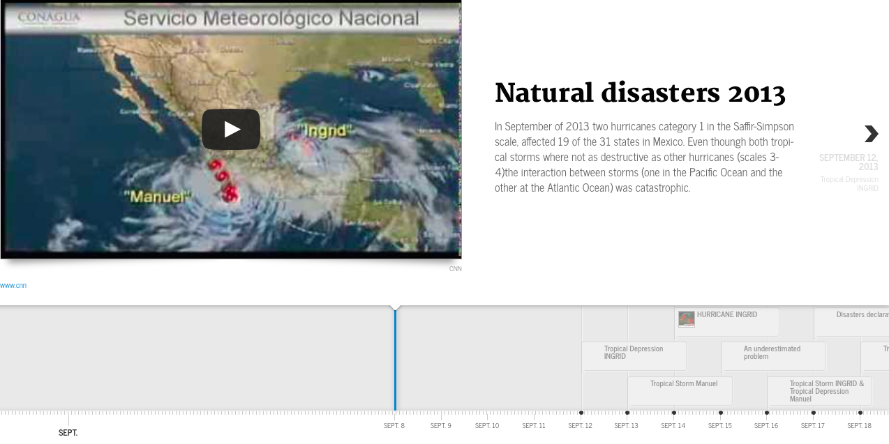
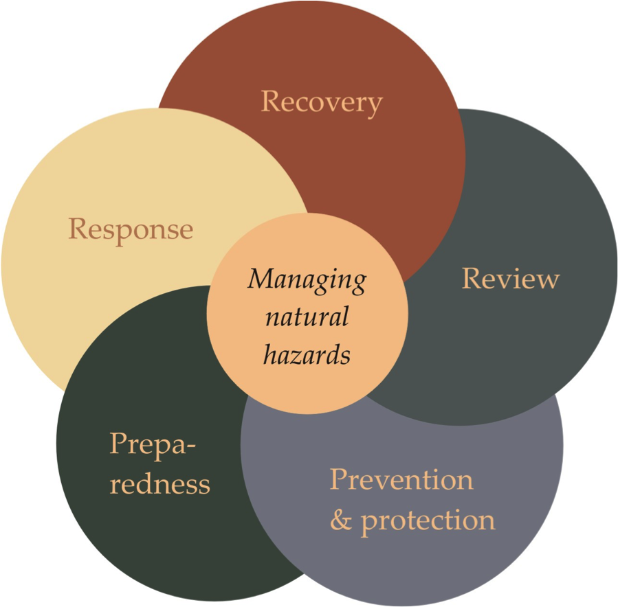
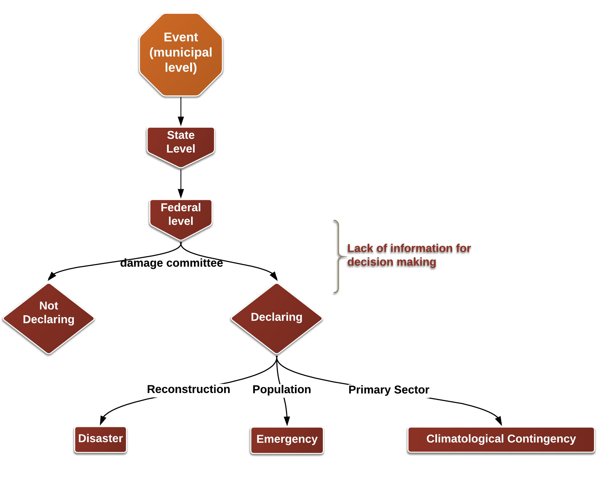
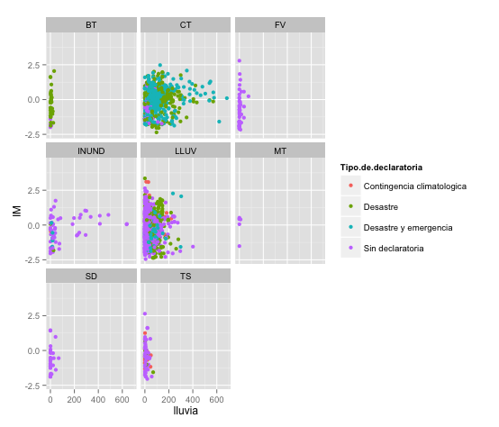
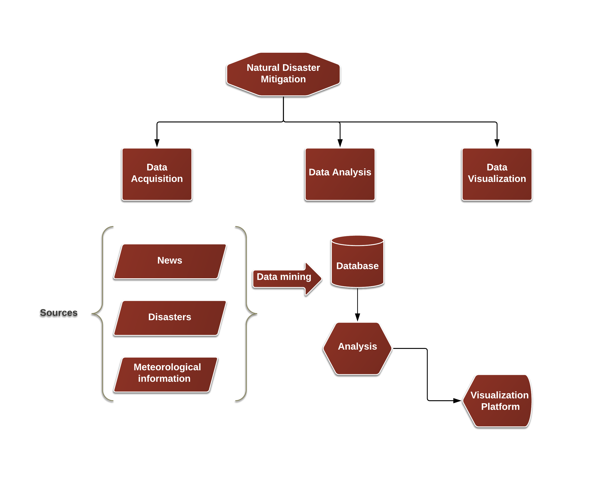
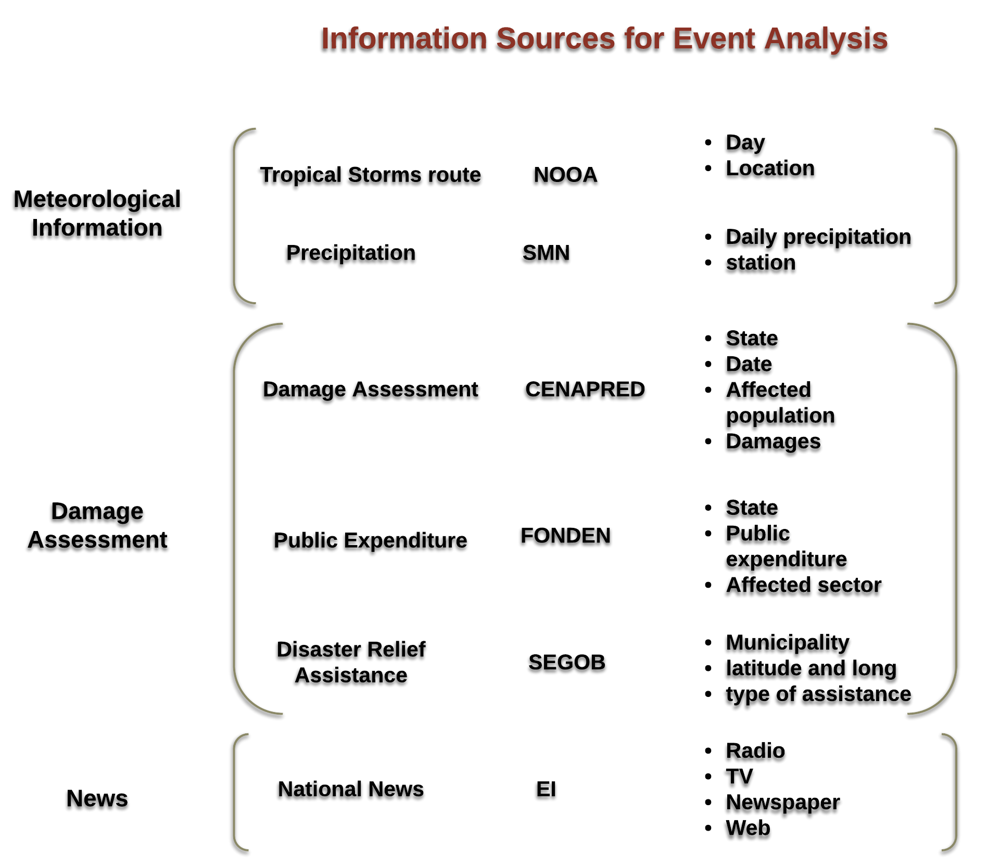
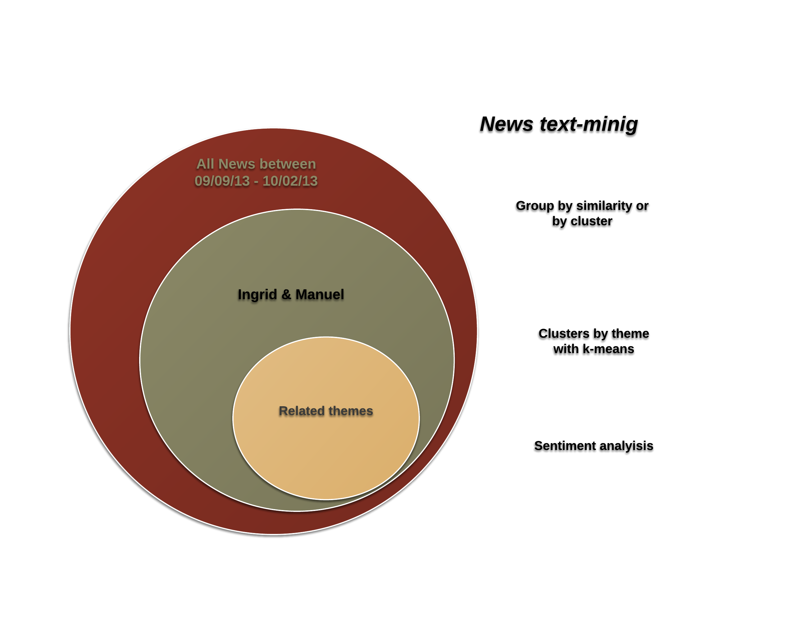
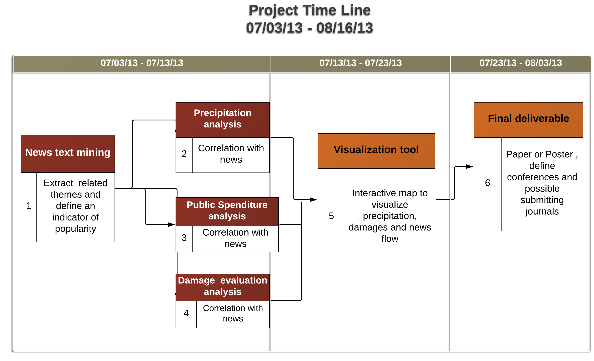

##Introduction 

Follow the [Disaster Time Line](http://cdn.knightlab.com/libs/timeline/latest/embed/index.html?source=1wesPOVIPMQLbCplDyt5ENxd_H74QPUYk1GuBslD1mFY&font=Merriweather-NewsCycle&maptype=toner-lines&lang=en&height=650) to learn more about the evolution of Ingrid and Manuel tropical storms.

##Disaster Risk Management 

source: CATALYST winter Resilience Academy, 2013

##Mexican Disaster Managment Process 

## Problem 

Lack of information during the disaster Meangement Proces and no clear rules 

## No clear rules 

Neither at a municipal level, using rainfall as a damages proxy 

##Objectives

Develop and apply methods to assess the suitability of using news flows and precipitation data to characterize disater damages in Mexico looking forward to resource allocation improvement( disaster managment).

We will work towards explaining the determinants of declaring or not declaring a disaster 

##Working plan 

* Analyze information flows using Newspaper, TV and radio data.
* Correlation of news flows with precipitation data.
* Correlation of news flows with damage  metrics (evaluation and public expenditure).
* Accompanying interactive visualization tools

##Workflow
The workflow of the project is the following: 

##Information Sources 

##News Porcesing 

## Project Time-Line

