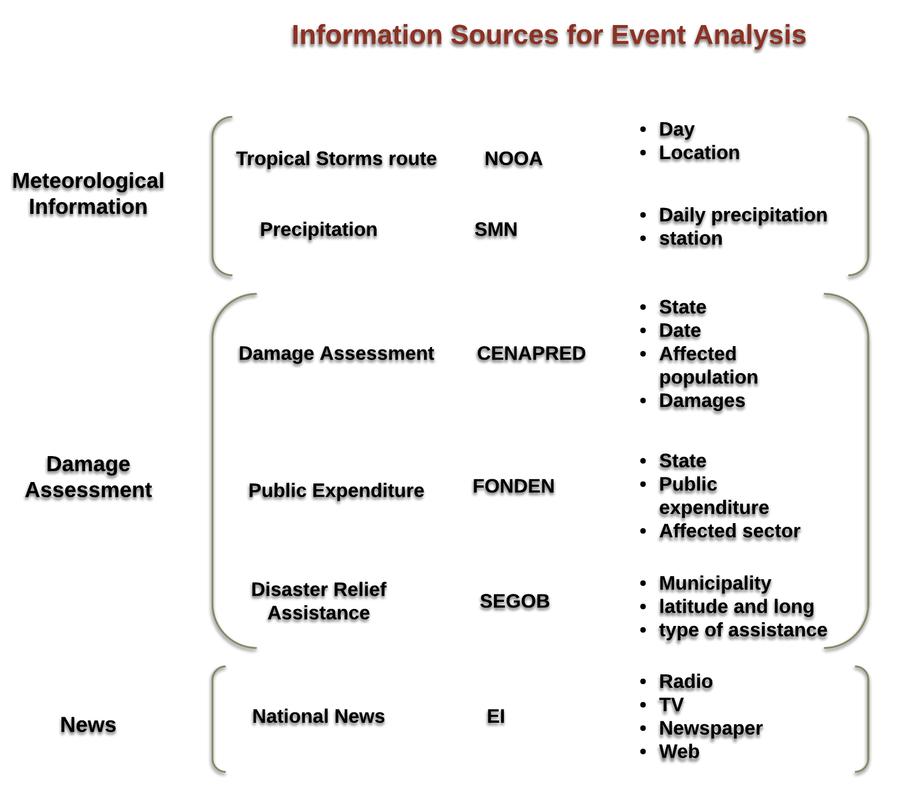
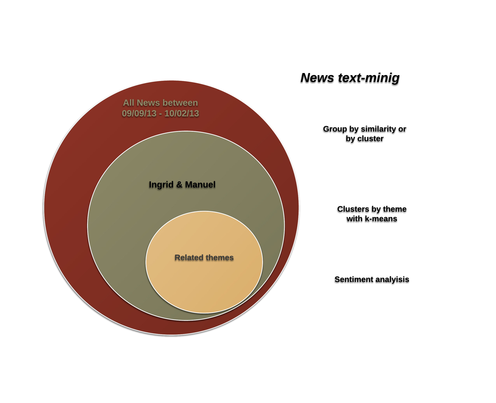

##Disaster Mitigation 

###Introduction 

Disaster resilience refers to the *ability of a system and its component parts to anticipate, absorb, accommodate, or recover from the effects of a hazardous event in a timely and efficient manner, including through ensuring the preservation, restoration, or improvement of its essential basic structures and functions*. \footnote{IPCC, 2012: Glossary of terms. In: Managing the Risks of Extreme Events and Disasters to Advance Climate Change } Three of the main factors for achieving resilience are: preparedness, reaction time and adaptability. For each of these factors, tools that enable monitoring and event identification are extremely important.\footnote{Ramirez-Marquez JE, Rocco CM. (2009) Stochastic network interdiction optimization via capacitated network reliability modeling and probabilistic solution discovery. Reliability Engineering and System Safety; 94(5):913–921}

The lack of information during and after a disaster is one of the main problems for public policy makers for disaster mitigation and even conflict prevention.\footnote{Meier, Patrick. (2014). Crisis Mapping in Areas of Limited Statehood. In Information and Communication Technologies in Areas of Limited Statehood, ed. Steven Livingston and Gregor Walter-Drop. Oxford University Press}\footnote{Meier, Patrick. (2014). Human Computation for Disaster Response. In Handbook of Human Computation, ed. Pietro Michelucci et. al, Springer}  Knowing how people are moving, sharing information and the range the information flow is vital for generating proper solutions, especially under emergency situations.\footnote{Sakaki T, Okazaki M, and Matsuo Y. (2010) Earthquake shakes Twitter users real-time event detection by social sensors. Proceedings of the 19th international conference on World wide web: 851-860}

Efforts have been done to direct user-generated content on social media to identify damaged zones in disasters.\footnote{Meier, Patrick. (2014). Using Advanced Computing to Verify User-Generated Content on Social Media, in The Verification Handbook, eds. Craig Silverman and Rina Tsubaki.} These efforts have focused on mapping crisis in areas of limited statehood or limited resources in which local disaster mitigation agencies have limited resources. 

This work will analyze information flow and its correlation with damage metrics using precipitation  and news data.  The main objective is to work towards an open and real time visualization platform for coordinating disaster mitigation decision making. For this purposes we will analyze a case of study for Mexico during September of 2013. 

In September of 2013 two hurricanes category 1 in the Saffir-Simpson scale, affected 19 of the 31 states in Mexico. Hurricane “Ingrid”\footnote{In the Atlantic Ocean }  took place during 12-17 of September and hurricane “Manuel”\footnote{In the Pacific Ocean }  13-20 of September.\footnote{CONAGUA(2014), “Reporte del Clima en México 2013”,  Coordinación General del Servicio Meteorológico Nacional} Even though both tropical storms where not as destructive as other hurricanes (scales 3 -5) the interaction between the two storms (one in the Pacific Ocean and the other at the Atlantic Ocean) was catastrophic.  Added to the fact that a lot of people went out for short vacations during 13-17 of September and the government was preparing for the independence holiday celebrations. Given the unpredictability and quickness in which disasters affect communities, a real time open visualization platform could help in these situations. 

\break

Follow the [Disaster Time Line](http://cdn.knightlab.com/libs/timeline/latest/embed/index.html?source=1wesPOVIPMQLbCplDyt5ENxd_H74QPUYk1GuBslD1mFY&font=Merriweather-NewsCycle&maptype=toner-lines&lang=en&height=650) to learn more about the evolution of Ingrid and Manuel tropical storms.

###Objectives

The objective of this project is to develop and apply methods to assess the suitability of using news flows and precipitation data to characterize disater damages in Mexico looking forward to resource allocation improvement.

The extension of the project depends of the data needed and gatherd. As mentioned above we will work towards an open, real time visualization platform for coordinated disaster mitigation for decision making.

#####Working plan 
* Analyze information flows using Newspaper, TV and radio data.
* Correlation of online activity with precipitation data.
* Correlation of online activity with damage  metrics.
* Accompanying interactive visualization tools

\break

The workflow of the project is the following: 

###Data 

The period of study is September 9th (3 days before hurricane Ingrid started) till October 2th (15 days after hurricane Manuel finished). The following section describes the 3 data groups needed for this project: 

\break

* **News data**: The Company “Eficiencia Informativa” [EI](http://data4.efinf.com/reader/web/) gathers information from electronic, newspaper, radio and TV news. The idea is to scrap all the news related to Ingrid and Manuel during the period of study. The company gave an acces for using their information till the endo of the year. 

They have different  formats for downloading the information. The best is CSV 

The idea is to do text mining for processing this database and follow the coverage of the disasters in the news. 

\newpage

  
* **Disaster Database**: 
    * *Disaster Evaluation*: The National Center for Natural Disaster Prevention (CENAPRED) is in charge of  the disaster damage and loss evaluation for the affected states. They gave us an  access to the National Risk Atlas [ANR](http://atlasnacionalderiesgos.gob.mx/) and  the evaluation dataset. Since Ingrid and Manuel Storms affected  19 of the 31 mexican states the government could not make a comprehensive damage evaluation. They were only  able  to do 5 damage evaluations (Durango, Guerrero, Nuevo Leon, Sianloa and Veracruz ). The access to the ANR is not working so good since  an older versión of explorer is needed. We are trying to access the platform in other system. \footnote{if the acces is not working next week we will procede to ask for each data base} 
    
    
     * *Public Spending*: The Ministry of Interior(SEGOB) manages the Disaster Relief Fond (FONDEN) through the National Civil Protection Service (SINAPROC)\footnote{For more information about FONDEN system see Garcia, A. (2014) "Desastres Naturales: Destrucción Creativa?",Chapter2, BA thesis ITAM}. The public spending records are available online [Recursos Autorizados](http://www.proteccioncivil.gob.mx/es/ProteccionCivil/Recursos_Autorizados_por_Declaratoria_de_Desastre). Ingrid y Manuel disasters have a lag of 3 years of public spending.  Each year has diferent format and information. We are working on the data cleaning. For following up the disasters, SEGOB opend a platform to inform the reconstruction actions and the money expeded [Presidencia](http://www.presidencia.gob.mx/fonden/). The data in this platform does not match with  the data obtained in FONDEN web site in spite of being the same govenrment entity. We already send a mail asking for this inconsistencies. 

* **Micro blog**:  Use Twitter information to measure mobility during Ingrid and Manuel. 

* **Meteorological Information**:  The precipitation data could help us as a proxy for damage metrics. The data could be obtained by NASA precipitation grid or by the National Meteorological System. 

\break

Data Set | Status | Process 
-------- | ---------- | ---------
News | Obtained | text mining 
Disaster Evaluation |Obtained | cleaninig 
Disaster Public Spending | Obteined | cleaning 
Twitter | waiting for acces to the DB |
Precipitation Data | waiting for acces to DB|

\break

